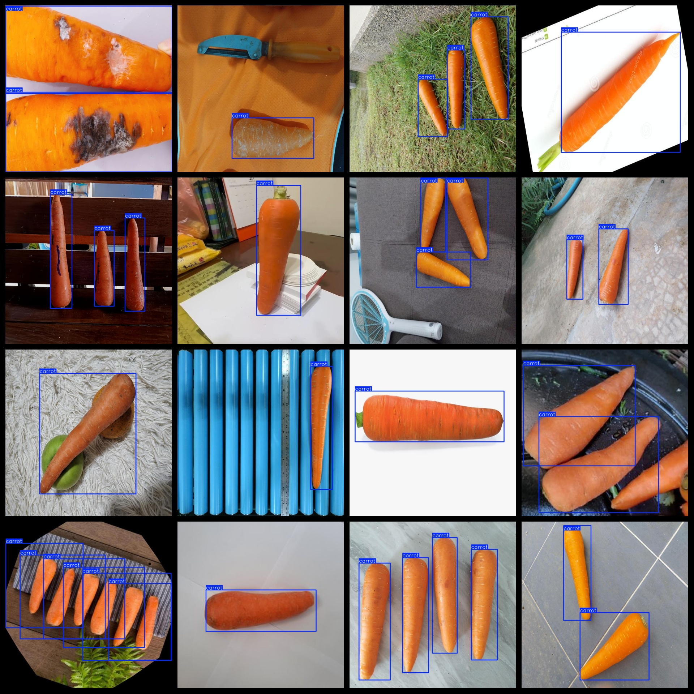
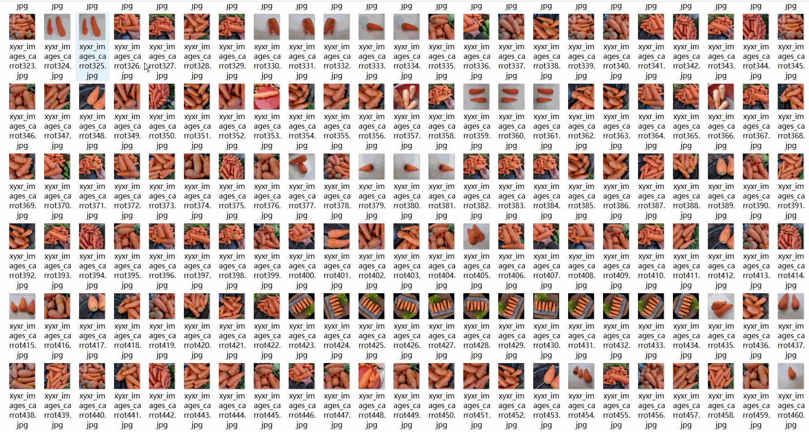

# Carrot Dataset 10798 imagesVOC+YOLO format（(Augmented) ）

The Dataset of Carrots includes 10,798 images in VOC+YOLO format (enhanced).

Dataset format: Pascal VOC format + YOLO format (the txt file does not contain the split path, it only contains jpg images and corresponding VOC format xml files and yolo format txt files)

Number of image files: 10798

Number of xml files: 10,798

Number of annotations (number of txt files): 10798

Number of categories: 1

The Github repository is: datasets_sl

["carrot"]

Number of boxes labeled in each category:

The number of carrots is 24565.

Total number of frames: 24565

Number of images per category:

Carrot occupies 10798 images.

Image resolution: 640x640

Use the labeling tool: labelImg

Dataset is augmented: Yes (Image augmentation percentage exceeds 60%)

Rules for annotation: Draw a rectangle around the category.

Important note: The dataset does not have been divided into training, validation, and testing sets.

Special Disclaimer: This dataset does not guarantee the accuracy of the trained models or weight files.

Annotation and image details are as follows:

## Images

---

Here is a pay link on Stripe (https://buy.stripe.com/3cs8yP7sY87d0vu9AB). Please contact me lonlonago@foxmail.com after funding $89, and I will send you a complete data files, thank you!

